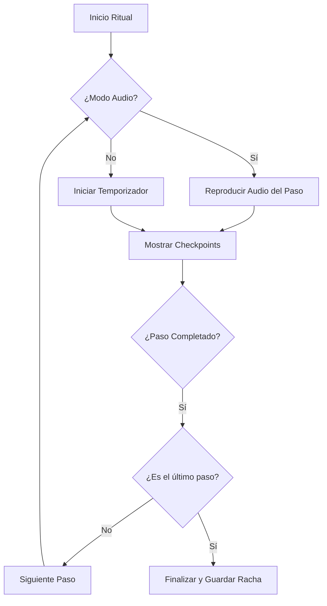

# Plan de Ajuste de Rituales y Estructura de Audios

Este plan detalla los cambios necesarios para alinear el desarrollo con el demo original, implementando la funcionalidad de 3 pasos para el Ritual C.A.F.É., incluyendo checklists y una estructura de almacenamiento de audios organizada.

## 1. Estructura de Almacenamiento (Principios SOLID / Clean Architecture)

Se creará una estructura jerárquica en el directorio `public` para garantizar la escalabilidad y facilidad de mantenimiento.

```text
public/assets/audio/rituals/
├── cafe/
│   ├── cuerpo.mp3
│   ├── alma.mp3
│   └── foco.mp3
├── PIT/
│   ├── atrapa.mp3
│   ├── reta.mp3
│   └── afirma.mp3
└── life/
    ├── liberacion.mp3
    ├── introspeccion.mp3
    ├── foco.mp3
    └── entrega.mp3
```

## 2. Actualización de Modelos de Datos (`types.ts`)

Añadiremos soporte para las nuevas funcionalidades del demo:
- `audioPath`: Ruta al archivo de audio del paso.
- `checkpoints`: Lista de tareas/verificaciones para cada paso.

```typescript
export interface RitualStep {
  id: string;
  title: string;
  description: string;
  durationSeconds: number;
  audioPath?: string; // Nuevo
  checkpoints?: string[]; // Nuevo (reemplaza o complementa la descripción)
}
```

## 3. Actualización de Datos Maestros (`constants.tsx`)

Ajustaremos el `Ritual C.A.F.É.` para que coincida con la "realidad" del demo (3 pasos):

- **Paso C - CUERPO**: 60s. Agua + Estiramientos.
- **Paso A - ALMA**: 120s. Respiración 4-7-8.
- **Paso F - FOCO**: 120s. Cuaderno físico, OEU, Visualización.

### Ritual PIT (3 min)
- **Paso A - ATRAPA**: Reten ese pensamiento automatico crítico.
- **Paso R - RETA**: Esto es 100% verdad, ¿qué le dirías a tu mejor amigo?
- **Paso A - AFIRMA**: Cuál es la nueva clausula de tu contrato.

### Ritual Life (4 min)
- **Paso L – Liberación:** Soltar la tensión física del día (estiramiento, respiración).
- **Paso I – Introspección:** Revisar qué pasó hoy, qué lograste y qué aprendiste.
- **Paso F – Foco (o Enfoque):** Definir la prioridad número uno para mañana.
- **Paso E – Entrega (o Éxito):** Cerrar el día, darlo por terminado y entregarse al descanso.

## 4. Mejoras en la Interfaz de Usuario (`RitualView.tsx`)

- **Componente de Checkbox**: Implementar una lista de verificación dinámica.
- **Gestión de Audio**: Integrar un elemento HTML5 `audio` que se sincronice con el paso actual.
- **Lógica de Avance**:
    - En modo manual: El botón "Siguiente" se habilita tras el 50% del tiempo. Es importante colocar la explicación del ejercicio en texto para guiar al usuario.
    - En modo audio: El botón "Siguiente" se habilita cuando el audio termina.

## 5. Diagrama de Flujo del Ritual



## 6. Documentación
Se actualizará el `README.md` para reflejar la nueva estructura de activos y las reglas de negocio de los rituales.

---
¿Estás de acuerdo con este plan para proceder a la implementación?

